# Creating Objective-C Bridging Frameworks (aka "Building Bridges")

Creating Objective-C bridging frameworks for Swift-only frameworks can be complex depending on the Swift framework chosen. 

Please note that these instructions are built around the [conventions expected](https://github.com/DelphiWorlds/SwiftBridges/blob/main/Contributions.md#bridging-frameworks) for this repo.

**References to `(FrameworkName)` throughout these instructions will refer to the name of the framework being BRIDGED.** e.g. Translation.

## Xcode Project

### Creating/configuring the project

1. `File` > `New` > `Project`:
   
   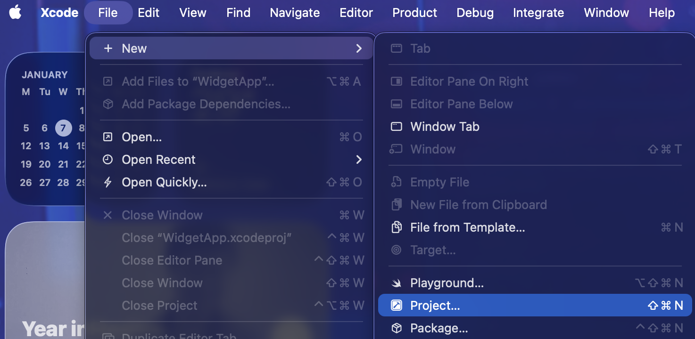
2. > `iOS` > `Framework` 
   
   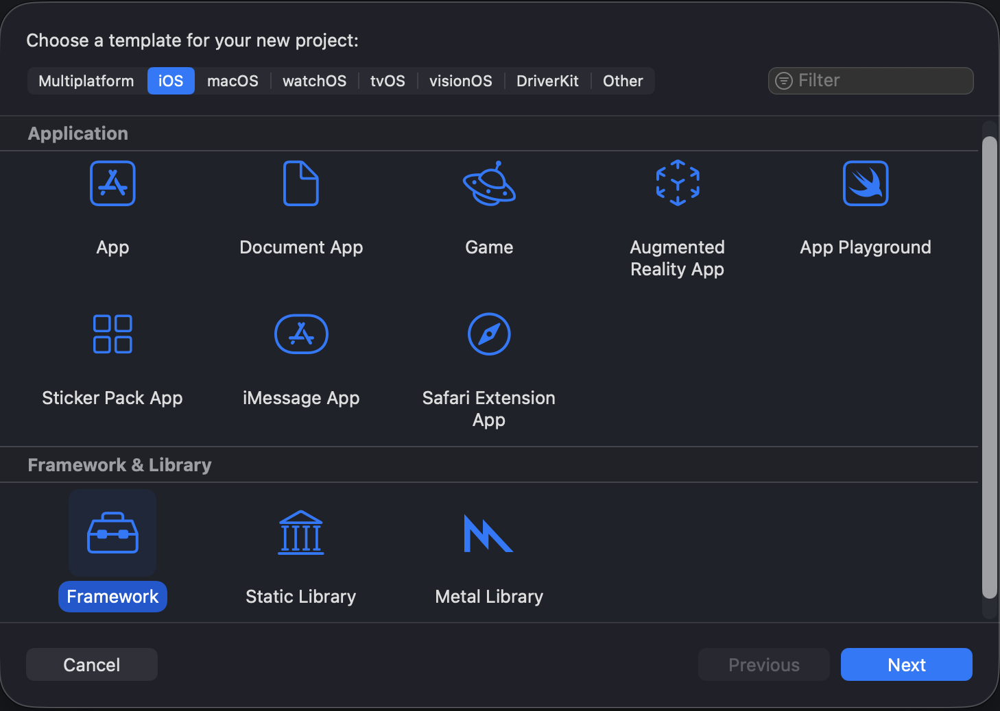

3. `Product Name`: **`(FrameworkName)ObjC`** > `Language`: `Objective-C`
   Where (FrameworkName) is the name of the Swift framework, e.g. `TranslationObjC` for the `Translation` framework, and click `Next`

   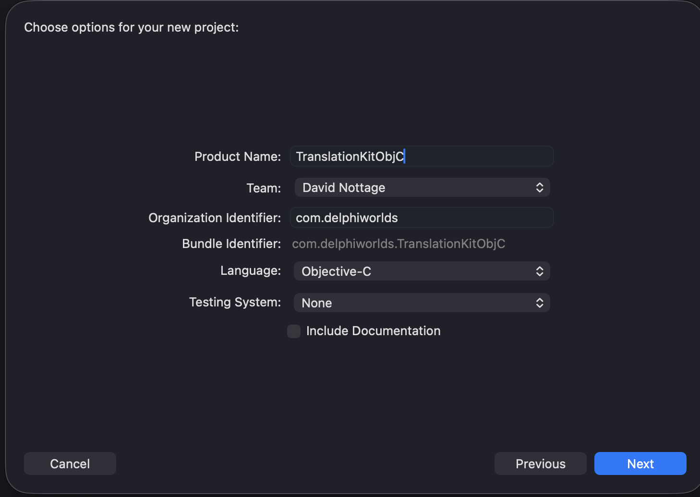

4. Select a folder where the project will be saved to and click `Create`:
   
   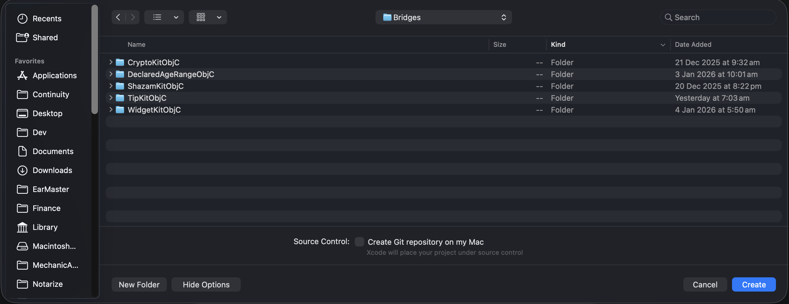
5. In the Project Explorer (select the Folder icon on the very left of the project window), select the root node
6. At the top of the project window, select `Any iOS Device (Arm64)` in the target devices list:
   
   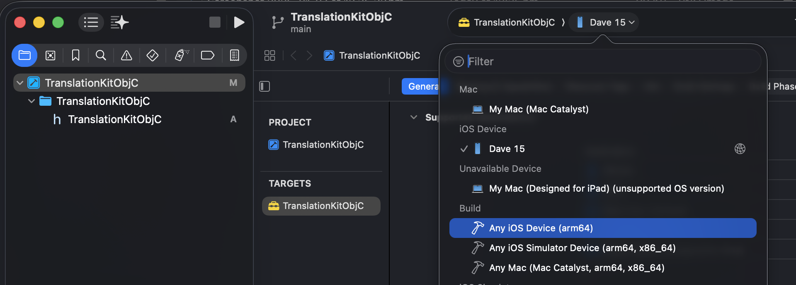
7. Select the target (`(FrameworkName)ObjC` e.g. `TranslationObjC`) in the `Targets` list
8. Select the `Build Settings` tab in the project options
9.  In the `Filter` box on the right, type in `Mach-O Type`:
10. Click the setting value (which will drop down a list) and select `Static Library`:
    
    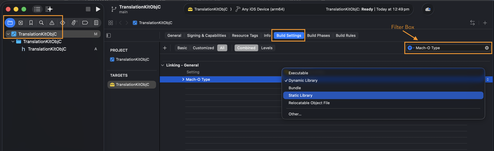
11. In the `Filter` box, type `iOS Deployment Target`
12. Click the setting value, and select `Other..`, which will open an edit box
    
    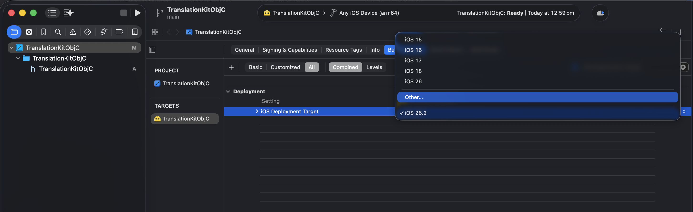 
13. Type in the iOS version that the framework was **introduced**, e.g. for Translation it was 17.4:
    
    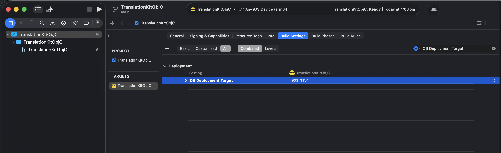

    This value can be found in the documentation on the Apple Developer documentation website.
14. In the `Filter` box, type `Skip Install`
15. Change the setting value to `No`:
    
    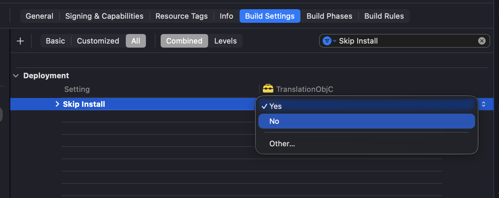
16. In the `Filter` box, type `Swift Language`
17. Change the `Swift Language Version` setting value to `Swift 5`
    
    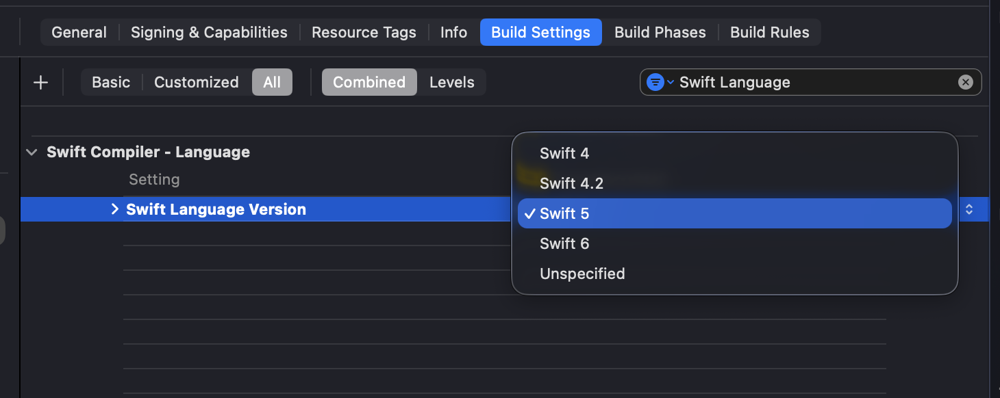

### Creating the Swift bridging file

1. `File` > `New` > `File From Template`:
   
   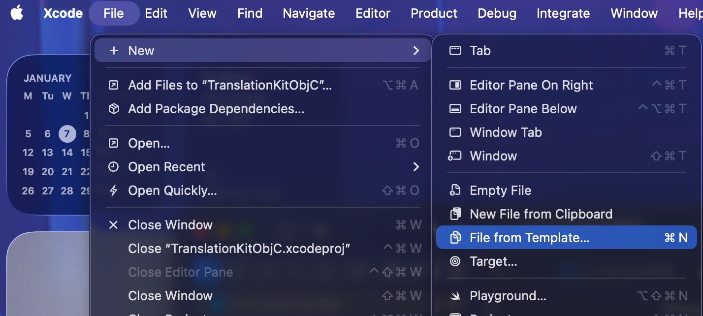
2. Select `Swift File` and click `Next`:
   
   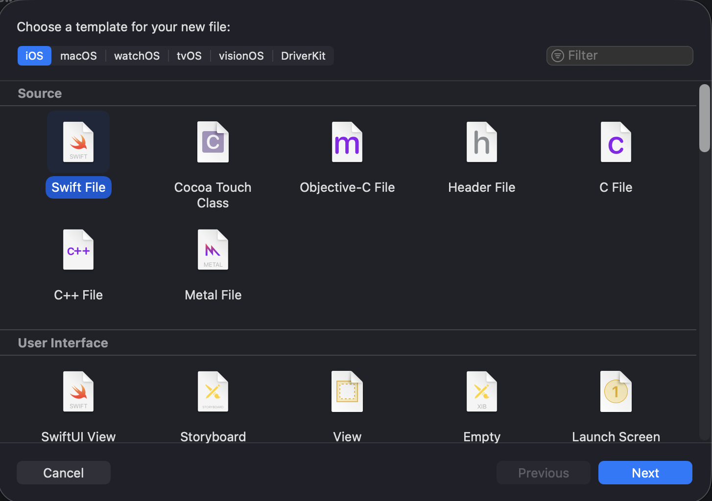
3. Name it the same as the framework being bridged, with a suffix of `Bridge`, e.g. `TranslationBridge`
4. Click `Create`
5. In the imports list, add an import for the framework, e.g.:

   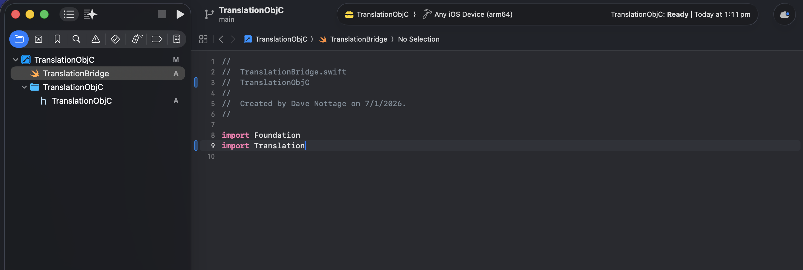
6. Hold down the `Command` button and click the framework name. This should generate a `swiftinterface` file in the editor. AI tools can use this file to generate the required code for the Swift bridge file as per step 2.

### Generating the code for the Swift bridge file, and Objective-C wrapper classes

As per the previous step, AI can be used to generate the required code, or if you're a wiz at Swift and/or Objective-C, code them by hand (ouch!)

In general, the following AI prompt could be used. Very different results may be generated depending on the AI. This prompt will hopefully ensure that the [expected conventions](https://github.com/DelphiWorlds/SwiftBridges/blob/main/Contributions.md#bridging-frameworks) are used: **In the prompt, make sure that you REPLACE (FrameworkName) with the ACTUAL framework that needs to be bridged**

```
Using the given .swiftinterface file, generate a file named (FrameworkName)Bridge.swift that contains types that allows them to be consumed by Objective-C code. In addition, generate .h and .m files for Objective-C wrapper classes that wrap the types in the Swift bridging file. Type names in (FrameworkName)Bridge.swift should be suffixed with "Swift" where necessary to avoid any name collisions. Class and Interface names in the Objective-C wrappers must be suffixed with "OC"
```

AI will almost certainly get it wrong the first time, so this will be an iterative process

### Adding the files to the Xcode project

Whether by using AI, or coding by hand, the Swift bridge file will need to be updated, and the Objective-C wrapper `.h` and `.m` files will need to be added. 

For the `(FrameworkName)Bridge.swift` file, paste the code. If using AI, generally it will be a complete overwrite of the contents.

For the `.h` files, in Xcode:

1. `File` > `New` > `File From Template`. If the code is in the clipboard, **Xcode can sometimes detect this** and suggest using that to create the file, otherwise proceed to step 2.
2. Select `Header File`.
3. Click `Next`
4. Use the Objective-C wrapper class name for the file name e.g. `TranslationOC.h`
5. Click `Create`
6. Paste the generated code

For the `.m` files, in Xcode:

1. `File` > `New` > `File From Template`. Xcode occasionally detects code in the clipboard for `.m` files, but more often than not, mistakes it for an `.h` file
2. Select `Objective-C File`
3. Click `Next`
4. Use the Objective-C wrapper class name in the `File` field
5. Click `Next`
6. Click `Create`
7. Paste the generated code

### Resolving AI's (or your) mistakes

As above, generally AI will never get this right the first time. You may notice as you are adding files and/or updating code that Xcode will highlight errors/warnings straight away, i.e. before you even build the framework.

Errors/Warnings are listed in the project navigator as pictured (this is a contrived example just to show how/where they're presented):

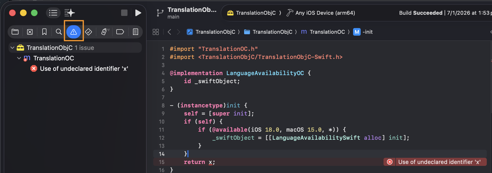

Use the mouse and/or keyboard to select the errors/warnings and Command+C to copy them to the clipboard. These can be then pasted into your AI to inform it of its mistakes. 

Alternatively, you may be able to recognize what mistakes it has made and resolve them yourself. Either way, once the issues have been resolved, move on to the next step

### Updating the "umbrella" header file

In order to successully build the framework, Xcode requires that the `.h` files you have added are included in `import` statements in the "umbrella" header file `(FrameworkName)ObjC.h` e.g. in `TranslationObjC.h`:

```
#import <TranslationObjC/TranslationOC.h>
```

### Ensure that relevant `.h` files are made **public**

Each `.h` file that is going to be imported from another language (e.g. Delphi) will need to be made public, so that when the framework is built, it will be included in the output. This will include the "umbrella" header file e.g. for the example so far:

```
TranslationObjC.h
TranslationOC.h
```

To do this, in Xcode:

1. Select each `.h` file **that needs to be made public** using the mouse and the `Command` key
2. In the Inspector (usually on the right), select the framework target (e.g. `TranslationObjC`) in the `Target Membership` box
3. Select the target in the list and click the Edit button (an icon of a pencil):
   
   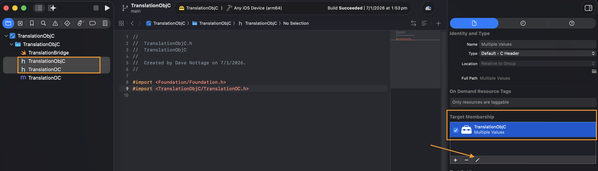
4. Ensure that `Header Visibility` is set to `Public`, and click `Save`:

   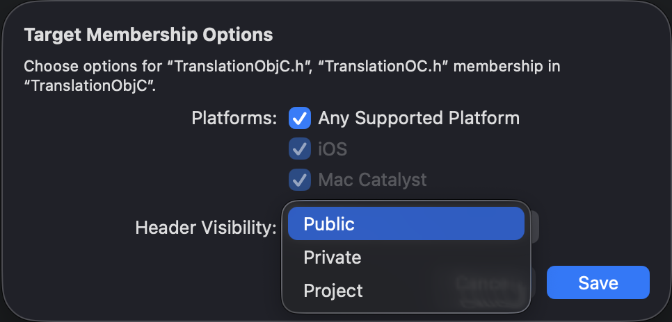

### Build the framework

In Xcode:

1. Product > Clean Build Folder
2. Product > Build

All being well, the framework should build successfully. The output will be in: 

`(FrameworkName)ObjC.framework` under the folder `~/Library/Developer/Xcode/DerivedData/(FrameworkProjectName)-xxxxxxx` where `(FrameworkProjectName)` is the name of the bridging project (e.g TranslationObjC) and `xxxxxxxx` is a unique identifier created by Xcode. Under *that* folder will be `/Build/Products/Debug-iphoneos` where the `.framework` folder is located 

If the build does not succeed, go back to [this section](#resolving-ais-or-your-mistakes).

Once the framework has been successfully built, an import for Delphi can be created.